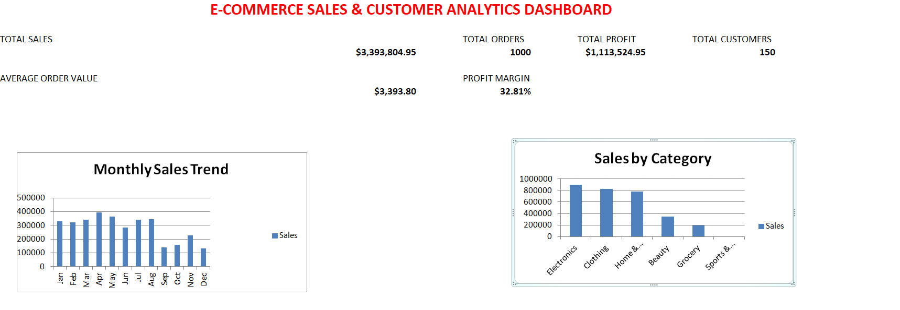

# 🛒 E-Commerce Sales & Customer Analytics Dashboard

An interactive **Microsoft Excel dashboard** designed to analyze e-commerce sales performance, profitability, customer behavior, product performance, and state-wise sales.

---

## 📊 Project Overview

This project transforms raw e-commerce transaction data into a clear and professional Excel dashboard.

The dashboard helps answer important business questions:

* How much total revenue was generated?
* What is the total profit and profit margin?
* Which categories and products perform best?
* Which states generate the highest sales?
* How many orders and customers are recorded?
* How does sales performance change month by month?

---

## 🛠️ Tools & Technologies

* **Microsoft Excel**
* Excel Tables
* Excel Formulas
* Data Cleaning
* Data Analysis
* Charts and Dashboard Design

---

## ✨ Dashboard Features

| KPI / Analysis         | Description                             |
| ---------------------- | --------------------------------------- |
| 💰 Total Sales         | Overall revenue generated               |
| 📦 Total Orders        | Total number of transactions            |
| 📈 Total Profit        | Overall profit earned                   |
| 👥 Total Customers     | Number of unique customers              |
| 🧾 Average Order Value | Average revenue per order               |
| 📊 Profit Margin       | Profit as a percentage of sales         |
| 📅 Monthly Sales Trend | Month-wise sales performance            |
| 🛍️ Sales by Category  | Category-wise revenue comparison        |
| 🏆 Top 10 Products     | Best-performing products by sales       |
| 📍 Sales by State      | State-wise sales performance            |
| 👤 Customer Analytics  | Customer-wise sales, profit, and orders |

---

## 📁 Workbook Structure

The Excel workbook contains the following sections:

* **Raw_Data** — Original transaction data
* **Analysis** — KPI calculations and detailed analysis
* **Customer Analytics** — Customer-level performance
* **Dashboard** — Visual charts and business insights
* **Read_Me** — Project information and instructions

---

## 📌 Key Excel Formulas Used

```excel
=SUM(SalesData[Sales])
```

```excel
=SUM(SalesData[Profit])
```

```excel
=COUNTA(SalesData[Order_ID])
```

```excel
=COUNTIF(SalesData[Customer_ID],P13)
```

```excel
=SUMIF(SalesData[Category],A28,SalesData[Sales])
```

```excel
=SUMIF(SalesData[State],F13,SalesData[Sales])
```

---

## 🎯 Business Insights

This dashboard can be used to identify:

* High-revenue product categories
* Most profitable products
* Strong-performing states
* Monthly sales patterns
* Customer purchase frequency
* Overall business profitability

---

## 🖼️ Dashboard Preview

Add your dashboard screenshot here:

```markdown

```

---

## 🚀 How to Use

1. Download the Excel workbook.
2. Open the file in Microsoft Excel.
3. Go to the **Dashboard** sheet.
4. Review the KPIs and charts.
5. Explore the **Analysis** and **Customer Analytics** sheets for detailed information.

---

## 📚 Learning Outcomes

Through this project, I practiced:

* Structuring raw datasets
* Using Excel formulas
* Creating analytical summaries
* Building charts
* Designing an Excel dashboard
* Presenting business insights visually

---

## 👨‍💻 Author

**Pranjul Parashar**

This project was created as part of my data analytics and Excel portfolio.

---

⭐ If you find this project useful, feel free to explore the workbook and share feedback.
